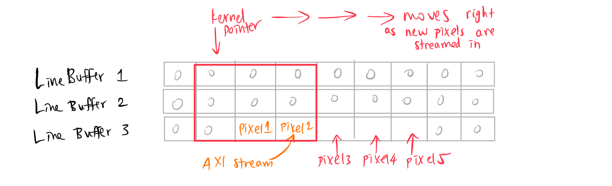
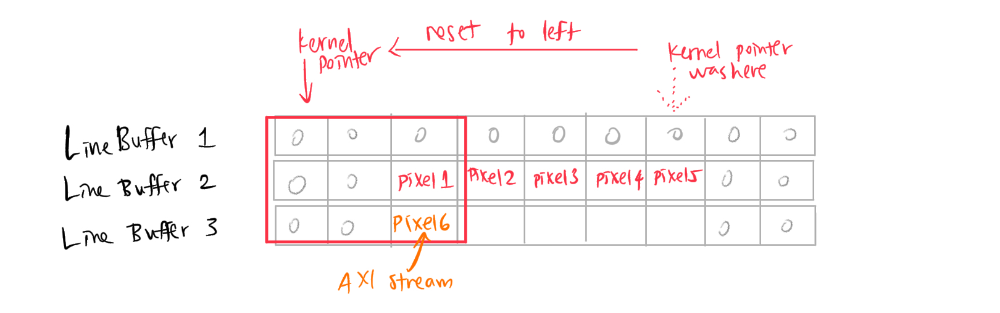
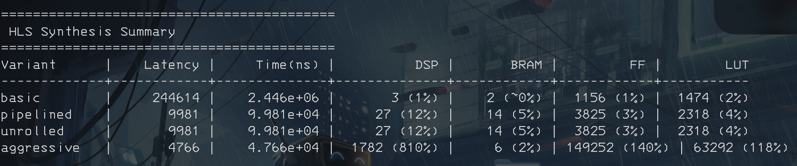
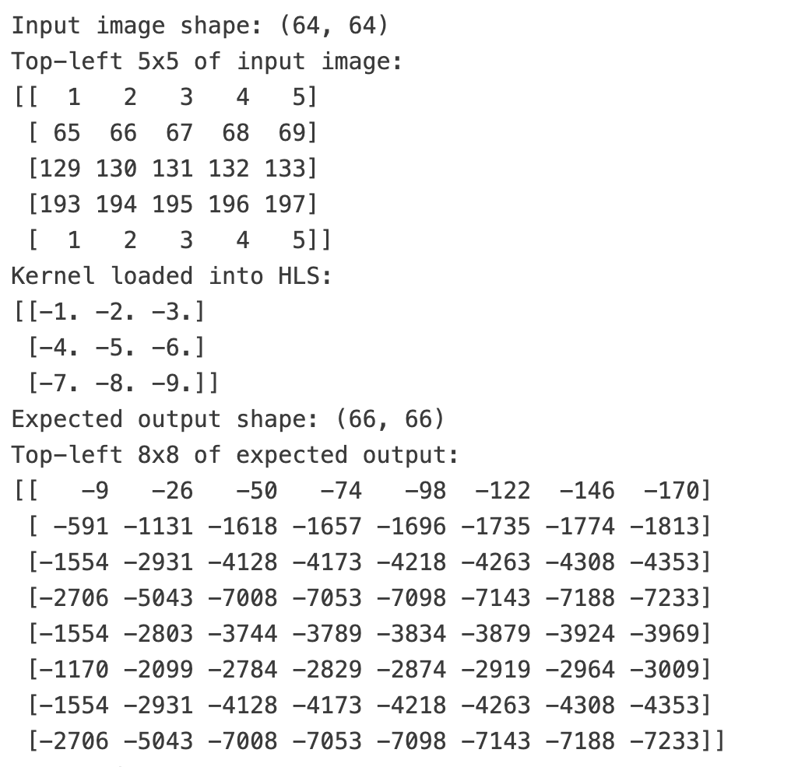
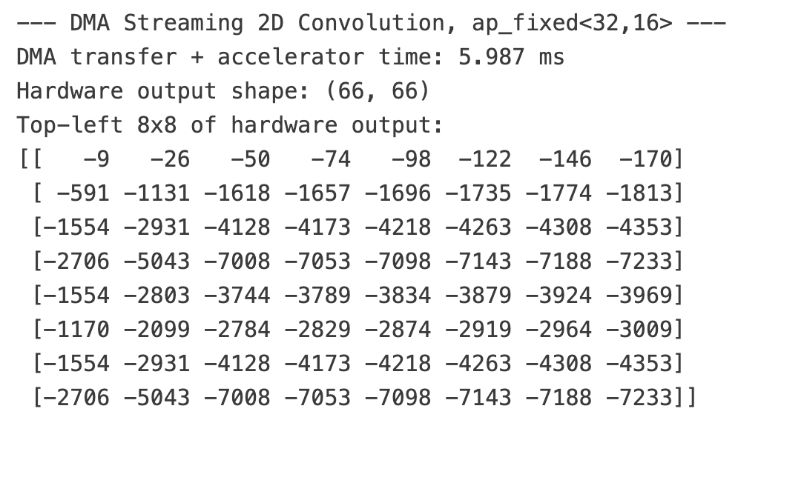
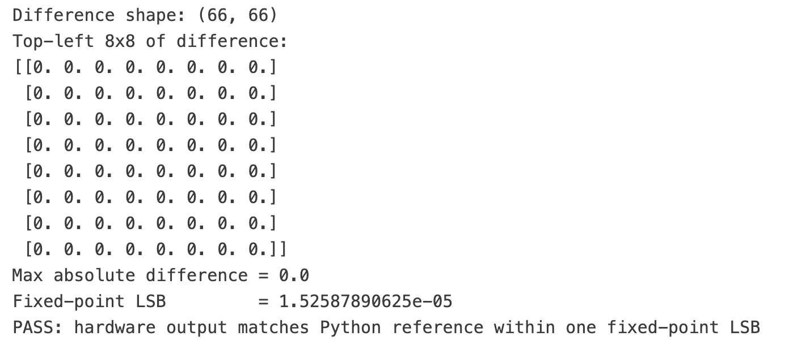
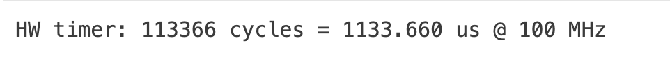
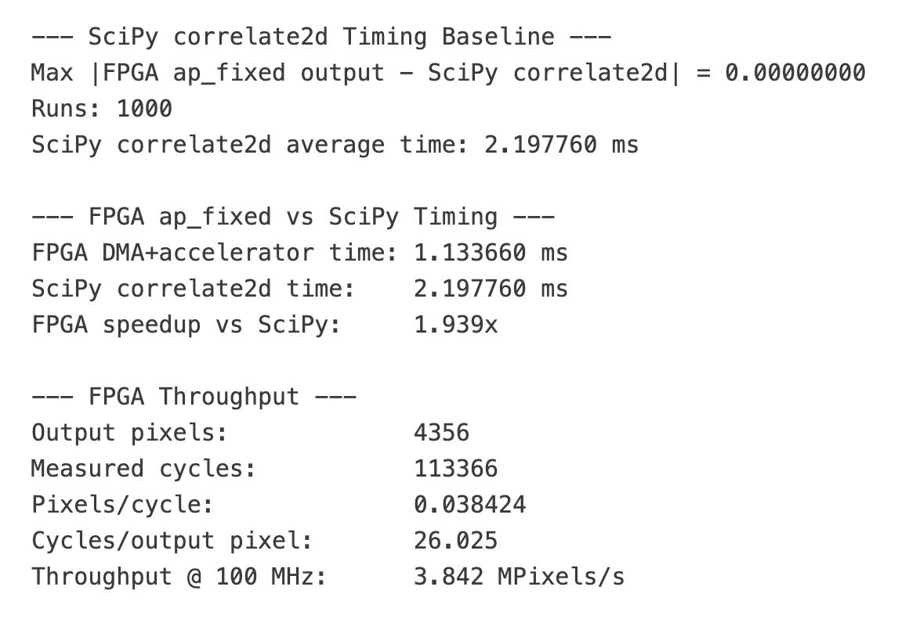

# 2D Convolution Accelerator - EE5332 Course Project

**Author:** Nithin Ken Maran  
**Roll No.:** EE23B050  
**Date:** April 2026

---

## Architecture

The 2D convolution accelerator is implemented using line buffers to store `K` rows of the image, where `K` is the dimension of the kernel. A sliding window is then used to compute the dot product between the kernel and the overlapping region of the line buffer contents.

An example architecture for a $3 \times 3$ kernel and a $5 \times 5$ image is shown below.

*Figure 1: Kernel is implemented as a sliding window over the line buffer. A MAC loop iterates over the overlapping elements to produce the output pixel.*

*Figure 2: When an image row gets filled, the line buffers are shifted up and the sliding window is reset to the left.*

---

## Pareto Tradeoffs

The following figure is the output of the `read_reports.sh` script, which compares the `csynth.rpt` files corresponding to four different directive configurations:

- `basic`: explicitly turns off loop pipelining and unrolling.
- `pipelined`: pipelines all loops and partitions the line buffer arrays.
- `unrolled`: same as `pipelined`, but also unrolls the MAC loop that computes the dot product between the kernel and the overlapping line buffer elements.
- `aggressive`: forces pipelining and unrolling of the outermost pixel processing loop.

### Tradeoffs

1. The `basic` version uses minimal resources, but has very high latency.
2. The `pipelined` and `unrolled` versions have much lower latency than `basic`, but use more resources.
3. The `aggressive` version has the least latency, but the DSP, FF, and LUT counts are much larger, and it cannot fit on the Pynq-Z2 board.

---

## Measured Results

### Correctness

*Figure 3: Expected Output.*

<table>
<tr>
<td width="42%" align="center">

*Figure 4: Hardware Output.*

</td>
<td width="58%" align="center">

*Figure 5: Difference between expected and hardware output.*

</td>
</tr>
</table>

### Timing

*Figure 6: AXI Timer Output.*

*Figure 7: Comparison with SciPy.*

Since the hardware assumes that the convolution kernel is pre-flipped before loading via AXI-Lite, we must use `correlate2d` from SciPy instead of `convolve2d`.

> As seen above, the hardware accelerator gives a **1.94× speedup** over the SciPy version running on ARM.
